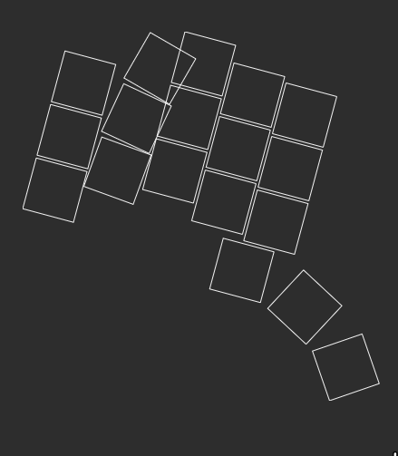
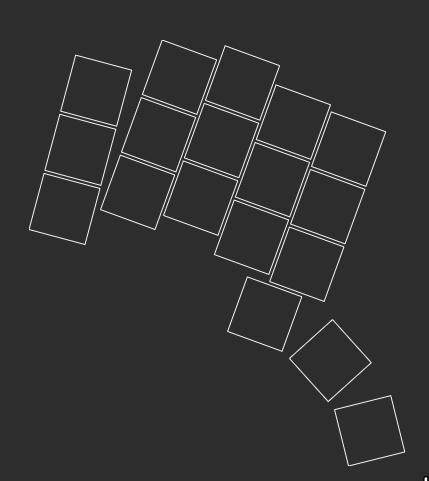

# Ergogen V4 Migration Guide

## What's this "Ergogen"?

[Ergogen](https://github.com/ergogen/ergogen) is a great tool for building and designing your own keyboard.
The best introductory videos to know my knowledge 
are [this video by Ben Vallack](https://www.youtube.com/watch?v=M_VuXVErD6E)
and [this talk by the creator himself](https://www.youtube.com/watch?v=5tERUZ_BSPM). 

Sadly, they are for version 3, and that's where this document comes in.

Oh and be sure to check out the [Discord](https://discord.com/invite/nbKcAZB), lots of helpful people there.

## What's this so-called "Guide"?

Ergogen recently went from v3 to v4, but sadly the creator didn't find the time to update the docs yet.
To ease the transition, I started collecting the necessary steps to transform your v3 configuration into a working v4
one!

However, this will not tell you about what v4 improved and can do now.
Sadly I don't have neither the time nor the insight (or the time to gain that insight) about v4 to produce a real guide,
you will have to wait until the updated docs for that.

## TOC

- [Necessary Steps](#necessary-steps)
- [Example](#example)
    - [Units](#units)
    - [Points](#points)
    - [Outlines](#outlines)
    - [PCBs](#pcbs)
    - [Cases](#cases)
- [Other Examples & Thanks](#other-examples--thanks)
- [Difference between Splay and Rotate](#difference-between-splay-and-rotate)

## Necessary Steps

- points:
    - nest `stagger` and `origin` in `key` field
    - nest `rotate` in `key` field and rename to `splay` (unless you really want `rotate`,
      see [Difference between Splay and Rotate](#difference-between-splay-and-rotate) for difference, spoiler: you don't
      want rotate anymore)
    - `footprints` need to be moved to `pcbs`. Also add `where: true` to apply them to all points
    - `row_overrides` has been superseded by `$unset`: `columns.col_x.row_overrides.row_y:` turns
      into `columns.col_x.rows.row_y: $unset` (a lot of people use `$skip: true` instead of `$unset` which works
      similarily)
    - `anchor`s with multiple refs, e.g. `anchor: [ref1, ref2]` need to be transformed into `anchor.aggregate.parts: [ref1, ref2]`. In the future, the aggregation method can be modified using `anchor.aggregate.method`, but default and old (and only) behavior is `average`
- outlines:
    - `glue` has been removed! I never worked with glue, so I'm not the best to tell you how to replace it, my guess
      would be to use a polygon. If you find a good and reliable solution, you know where to find me
    - remove `exports` nesting
    - rename `type` to `what`
    - rename `anchor` to `adjust`
    - switch `type: keys` to `what: rectangle` and add `where: true`
    - `rectangles` now have their origin centered instead of in the bottom left corner, so for the old behaviour you
      need to shift them by `[width/2, height/2]`
- pcbs:
    - rename `class` to `designator`
    - rename `type` to `what`
    - rename `anchor` to `adjust`
    - move parameters from `nets` to `params`
    - change `from: =colrow` (and similar) to `from: "{{colrow}}"`

Still to figure out:

- everything I didn't need for my own board, if you know anything missing, hit me up/PR/issue/msg me on discord @Anarc 
  :thumbsup:

## Example

Here we have a little example that forms a 2-key board, complete with case and pcb.

If you're looking for something I didn't cover in "Necessary Steps", your best bet will be to check out the other
examples in [Other Examples & Thanks](#other-examples--thanks), this will just be most of the steps I discovered so far in
action.

### Units

Nothing to change here as far as I know.

```yaml
# v3 & v4
units:
  center_shift_x: 170
  center_shift_y: -165
```

### Points

```yaml
# v3
points:
  zones:
    matrix:
      anchor: # this will still be anchor!
        shift: [ center_shift_x, center_shift_y ]
      columns:
        outer:
          key:
            col_net: c0
        pinky:
          stagger: .5cy             # move this into key
          key:
            col_net: c1
      rows:
        extra:
          row_net: r0
  key:
    padding: cy
    footprints:                     # move this into pcbs
      choc_hotswap:
        type: choc                  # change to "what: choc"
        nets:                       # move content to params
          from: =colrow             # turn this into "{{colrow}}"
          to: =col_net              # turn this into "{{col_net}}"
        params:
          keycaps: true
          reverse: true
          hotswap: true
      diode:
        type: diode                 # change to "what: diode"
        params:
          through_hole: false       # no through_hole option is gone now? :sad_face:
        nets:                       # move content to params
          from: =colrow             # turn this into "{{colrow}}"
          to: =row_net              # turn this into "{{col_net}}"
        anchor:                     # rename to adjust
          shift: [ 0, -5 ]
```

```yaml
# v4
points:
  zones:
    matrix:
      anchor:
        shift: [ center_shift_x, center_shift_y ]
      columns:
        outer:
          rows.extra.skip: false
          key.col_net: c0
        pinky:
          rows:
            extra:
              skip: false
          key:
            stagger: .5cy
            col_net: c1
      rows:
        extra:
          skip: true
          row_net: r0
  key:
    padding: cy
```

### Outlines

```yaml
# v3
outlines:
  exports:
    switches:
      - type: keys
        side: left                  # this will be gone, I think replaced with where logic, but split ones didn't need it anyway (at least I didn't)
        size: 14
    switches_lips:
      - type: rectangle
        size: [ 15, 14 ]
    board:
      - type: rectangle
        anchor:                     # rename this to adjust
          ref: matrix_pinky_extra
          shift: [ -.5cx, -.25cy ]
        size: [ 30, 30 ]
        corner: 5
      - -switches
```

...digivolves to...

```yaml
# v4
outlines:
  _switches:
    - what: rectangle
      where: true
      size: 14
      bound: false
  _switches_lips:
    - what: rectangle
      where: true
      size: [ 15, 14 ]
      bound: false
  _pcb:
    - what: rectangle
      adjust:
        ref: matrix_pinky_extra
        shift: [ -.5cx, -.25cy ]
      size: [ 50, 50 ]
      corner: 5
  plate:
    - _pcb
    - -_switches
  _plate_with_lips:
    - _pcb
    - -_switches_lips
```

### PCBs

So I didn't want to blow this example up, but obviously you could have footprints in here already, and they would need
to same modifications as the ones in `points`. You only need to add `where` if you want to have your footprint per point
tho!

To make the comparison easier, here's also the footprints from earlier again:

```yaml
# v3 points.key
footprints:                     # move this into pcbs
  choc_hotswap:
    type: choc                  # change to "what: choc", and since there's no anchor, add "where: true" to apply to all points
    class: S                    # change to "designator: S"
    nets:                       # move content to params
      from: =colrow             # turn this into "{{colrow}}"
      to: =col_net              # turn this into "{{col_net}}"
    params:
      keycaps: true
      reverse: true
      hotswap: true
  diode:
    type: diode                 # change to "what: diode"
    params:
      through_hole: false       # no through_hole option is gone now? :sad_face:
    nets:                       # move content to params
      from: =colrow             # turn this into "{{colrow}}"
      to: =row_net              # turn this into "{{col_net}}"
    anchor:                     # rename to adjust
      shift: [ 0, -5 ]
```

...and the actual pcbs field from before:

```yaml
# v3
pcbs:                               # see points.key.footprint
  my_pcb:
    outlines:
      main:
        outline: board
```

```yaml
# v4
pcbs:
  my_pcb:
    outlines:
      main:
        outline: _pcb
    footprints:
      choc_hotswap:
        what: choc
        where: true
        designator: S
        params:
          keycaps: true
          reverse: true
          hotswap: true
          from: "{{colrow}}"
          to: "{{col_net}}"
      diode:
        what: diode
        where: true
        params:
          from: "{{colrow}}"
          to: "{{row_net}}"
        adjust:
          shift: [ 0, -5 ]
```

### Cases

Again, nothing to change here! (I think)

```yaml
# v3 & v4
cases:
  my_plate:
    - name: board
      extrude: 1.2
      shift: [ -center_shift_x, -center_shift_y, 0 ]
    - name: _plate_main_lips
      extrude: 1
      shift: [ -center_shift_x, -center_shift_y, 1.2 ]
```

## Other Examples & Thanks

Other v4 examples (both with more things than mine here):

- https://gitlab.com/Audijo/keyboard/-/blob/master/claw.yaml by `@LogicJB`
- https://github.com/MrCarney/mrkeyboard/blob/main/mrkeyboard.yaml by `@PedroTheIntern`

They are also what I used to figure out what to do, so kudos to their efforts of scouring through v4 without help!

## Difference between Splay and Rotate

As promised, here's a comparison of the two (courtesy of @Cache):

Here's what `rotate` and `splay` do in v4:

|                               rotate                                |                                splay                                |
|:-------------------------------------------------------------------:|:-------------------------------------------------------------------:|
|  |  | 

In conclusion: you'll probably want `splay`, but `rotate` might now be interesting for your curved thumb cluster.
